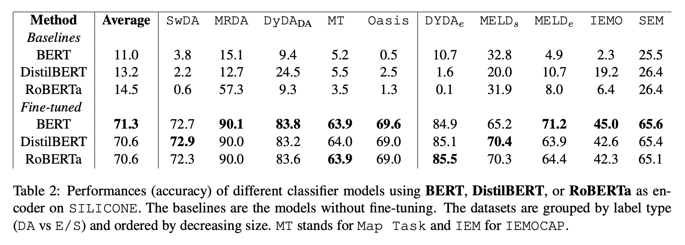

## Fine-tuning Pre-trained Language Models for Dialog Act Classification and Sentiment Analysis

This repository contains the code of the paper: [Fine-tuning Pre-trained Language Models for Dialog Act Classification and Sentiment Analysis](https://www.overleaf.com/project/63e2b657fad9f26ee64d7c3c).

## Overview

This paper presents an approach for fine-tuning pre-trained language models to perform dialog act classification or sentiment/emotion analysis. We start with a pre-trained language model and fine-tune it on task-specific datasets from **SILICONE** using transfer learning techniques. Our approach improve the model's ability to capture task-specific nuances while retaining its pre-existing language understanding capabilities. We experiment with different pre-trained models and compare their performances. We also perform undersampling on training data to evaluate the performance gain associated with data balancing. Overall, our findings suggest that fine-tuning pre-trained language models is an effective approach for improving the performance of dialog act classification and sentiment analysis models.

## Reproduce
### Data
The data used are datasets from [**SILICONE**](https://huggingface.co/datasets/silicone).

### Environment
We use `venv` to manage the environment.

### Script
**train_classifier.py**

### Key Arguments
In the config file **config.py** , there are several key arguments you may change depending your choice of training:
1. *CUDA_DEVICE*: number of GPU core(s) to be used for the training
2. *HOME*: repository path
3. *DATASET_NAME*: the name of the dataset on which the model is trained/evaluated
4. *CLASS_NUMBER*: number of classes corresponding to the dataset
5. *BALANCE*: True if undersampling False otherwise
6. *ENCODER_PATH/TOKENIZER_PATH*: the HuggingFace name of the pre-trained model to use
7. *VERSION*: number corresponding to the version of the training
8. *BATCH_SIZE, LEARNING_RATE, NUM_EPOCHS*: training hyperparameters


### How
1. Set-up the environment
```bash
python -m venv training
source training/bin/activate
pip install -r requirements.txt
```
2. Train a model
```bash
cd src/scripts/
python train_classifier.py after uncommenting train() and commenting verify() and test()
```
3. Evaluate a model
```bash
cd src/scripts/
python train_classifier.py after uncommenting train() et commenting verify() et test()
```

## Results

